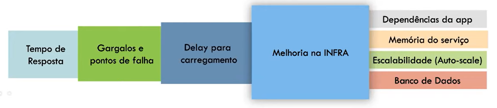

<h1 align="center">
  Automação de Testes de Performance com Gatling
</h1>

<p align="center">
  <a href="#-projeto">🖥️ Projeto</a>&nbsp;&nbsp;&nbsp;|&nbsp;&nbsp;&nbsp;
  <a href="#-tecnologias">🚀 Tecnologias</a>
</p>

<p align="center">
<a href="https://wakatime.com/badge/user/68660678-6b86-4b78-98df-f5f41a37e1bc/project/86c0f60c-315b-4958-85e4-9cecac11ea19"></a>
</p>

## 💻 Projeto

Repositorio criado para o curso de "Automação de Testes de Performance com Gatling" da DIO.

## 🚀 Tecnologias

- Gatling

---

## Executar testes por linha de comando

```shell
./gradlew clean gatlingRun-simulations.RegisterUserSimulation
```

## Executar testes por linha de comando passando parâmetros

```shell
TOTAL_USERS=2 RAMP_DURANTION=2 ./gradlew clean gatlingRun-simulations.RegisterUserByJSONSimulation
```

## Executar testes por linha de comando no ambiente local

```shell
ENV=local TOTAL_USERS=2 RAMP_DURANTION=2 ./gradlew clean gatlingRun-simulations.RegisterUserByJSONSimulation
```

---

## O que é teste de performance?

São testes para validar o comportamento e funcionamento do serviço com relação ao seu desempenho em um ambiente monitorado e controlado.

## O que o teste garante?

Que as aplicações, serviços, servidores, gateway e demias componentes da infraestrutura irão se comportar e atender aos requisitos de desempenho definidos.

## Tipos de testes de performance

### Carga

Avalia a capacidade do sistema em processar cargas crescentes.
Ex: número de usuários simultâneos definidos a partir de métricas ou expectativas do produto.

### Stress

Avalia o comportamento do sistema ao processar cargas acima do volume normal de trabalho.
Ex: número de usuários acima do definido.

### Escalabilidade

Avalia o comportamento do sistema com alteração gradual de carga, além do tempo de recuperação em caso de falhas.
Ex: alternar/diminuir números de usuários de forma gradual.

### Capacidade

Avalia a carga suportada pela aplicação em relação aos requisitos de performance definidos.
Ex: quantas requisições por segundo a aplicação consegue processar.

### Resistência

Avalia o comportamento do sistema durante longos períodos de tempo com cargas normais de trabalho.
Ex: número de usuários definidos a partir de métricas ou expectativas do produto durante um período maior de tempo.

### Pico

Avalia o comportamento do sistema em processar altas e baixas cargas.
Ex: alternar/diminuir números de usuários com picos variados de cargas.

## Ganhos com testes de performance



---
